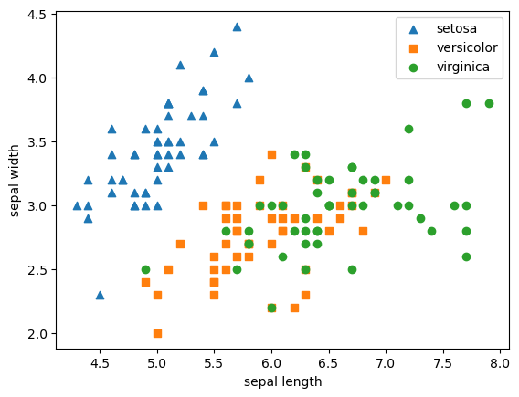
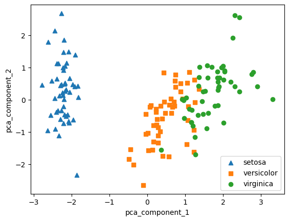

# PCA 변환

## 차원의 저주 :

차원이 커질수록 데이터 포이트들간 거리가 크게 늘어남, 다중공선성 문제 발생

불필요한 피처들을 줄여서 모델성능 향상에 기여 (다차원 데이터를 3차원 이하의 차원 축소)

어떻게 하면 원본 데이터의 정보를 최대한으로 유지한 채로 차원축소를 수행할 것인가?

- 피처 선택  : 주요 피처만 선택
- 피처 추출 : 기존 피처를 저차원의 중요 피처로 압축해서 요약 후 추출 (새롭게 만들어 낸 것)

차원축소는 피처 추출에 더 연관이 크다. 

차원 축소를 통해 좀 더 데이터를 잘 설명할 수 있는 잠재적인 요소를 추출하는데 있다 

- 추천엔진, 이미지 분류 및 변환(CNN 나오기 전), 문서 토픽 모델링

### PCA : principle component Analysis

원본 데이터 변동성이 가장 큰 방향으로 순차적으로 축들을 생성하고 이렇게 생성된 축으로 데이터를 투영하는 방식임.

1→2 데이터 변동성(variance)이 가장 큰 방향으로 축 생성(첫번째 벡터 축)

2→3 새로운 축으로 데이터 투영( 

3→4 새로운 축 기준으로 데이터 표현 

선형대수적인 관점에서..

입력 데이터의 공분산행렬(covariance matrix)를 고유값 분해하고, 이렇게 구한 고유 벡터에 입력 데이터를 선형 변환 하는 것입니다.

고유벡터는 PCA 주성분 벡터로서 입력 데이터의 분산이 큰 방향을 나타냅니다

고윳값은 바로 이 고유 벡터의 크기를 나타냅니다 

1. 원본데이터의 공분산 행렬(여러 변수와 관련된 공분산을 포함한 정방향 행렬이며 대칭 행렬, A=A(transpose)) 추출
2. 공분산 행렬을 고유벡터와 고유값 분해
3. 원본 데이터를 고유 벡터로 선형 변환(특정 벡터를 곱하여 새로운 공간에 매핑하는 것)
4. PCA 변환 값 도출 
    
    

즉 PCA 변환 절차 : 

1. 입력데이터 세트의 공분산 행렬을 생성
2. 공분산 행렬의 고유 벡터와 고유값을 계산
3. 고유값이 가장 큰 순으로 k개 만큼 고유벡터를 추출함
4. 고유값이 가장 큰 순으로 추출된 고유 벡터를 이용해 새롭게 입력 데이터를 변환함

### 코드 및 결과 
pca를 적용하기 전에 입력데이터 개별 피처들을 스케일링(스탠다드 스케일러)
pca는 여러 피처의 값을 연산해야하므로 스케일 영향을 받는다. 따라서 여러 속서을 pca로 압축하기 전에 각 피처들의 값을 동일한 스케일로 변환하는 것이 필요 
1. PCA 변환 전 

2. PCA 변환 후 

 -X 축으로는 잘 모였다.